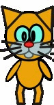
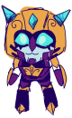
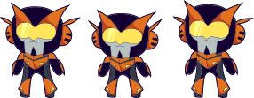
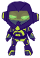

# TFStory

 
  

Some code to create a graphic novel kinda game.

Probably, will not compile locally, because uses dependencies: 

. UnitTesting: https://github.com/google/googletest
. Logger:  https://github.com/gabime/spdlog
. IniFile reader: https://github.com/dujingning/inicpp
. Multimedia support lib: https://github.com/sfml/sfml

Right now code supposes that googletest, spdlog and sfml are installed already and inicpp is imported.

Will fix build in next releases.

Also pictures of sprites and menus and sounds are just random, since I'm still waiting for my Production Designer/Artists/Screenwriter to produce real game script and art. And music.

